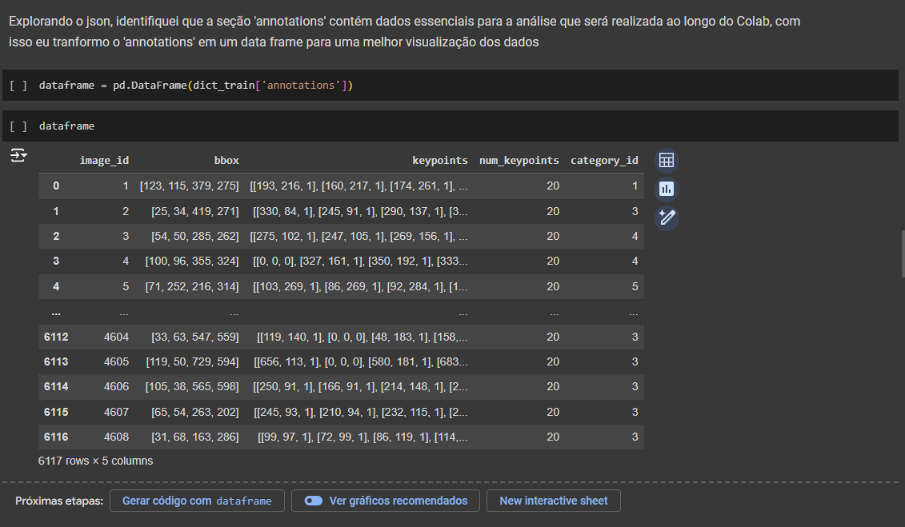
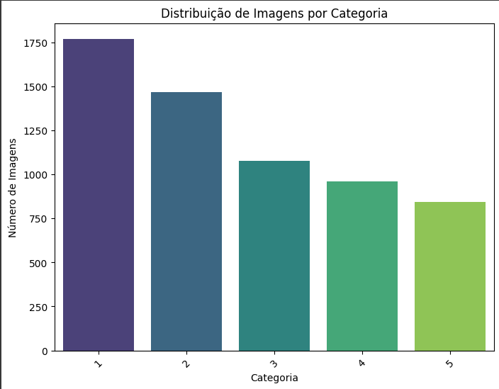
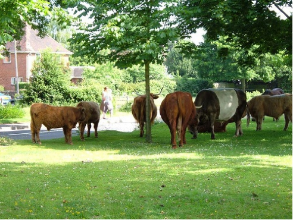
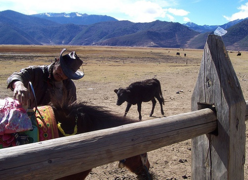
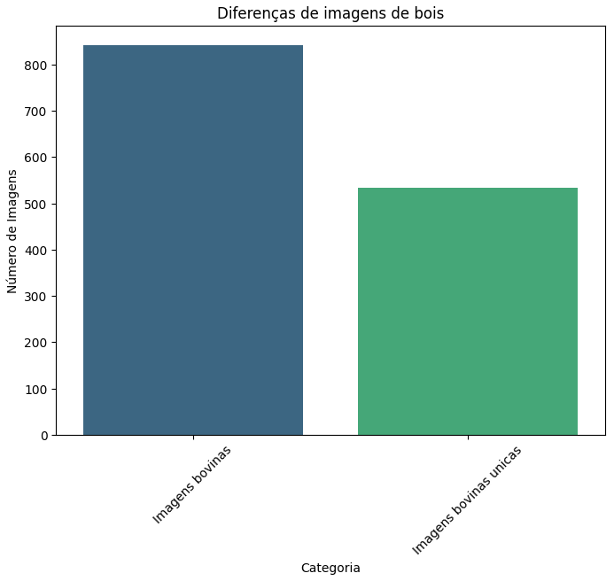
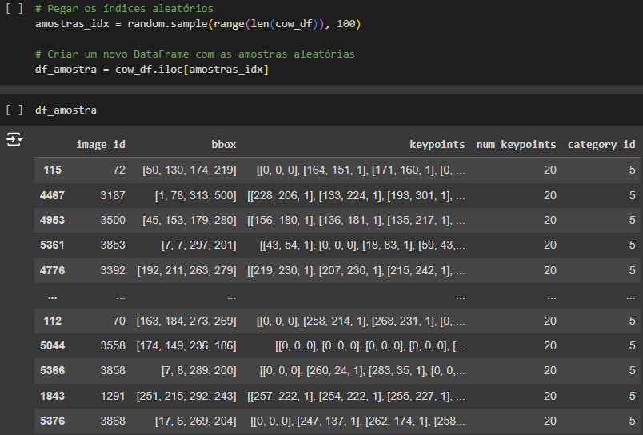
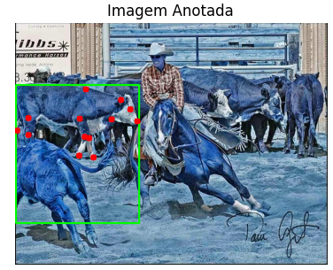
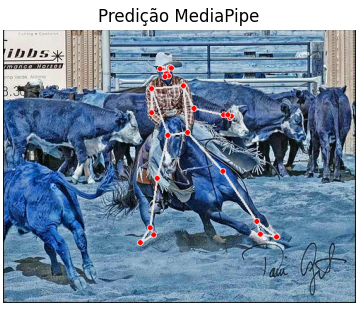
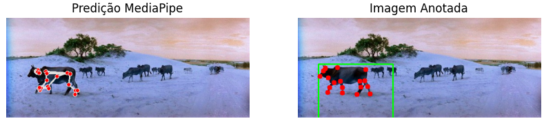

## 1. Análise Exploratória

Nesta seção, o objetivo foi explorar o dataset e obter insights importantes para o projeto de pose estimation. Recebemos um arquivo ZIP que continha um JSON com todas as informações necessárias do dataset Animal-Pose.

O arquivo JSON possui as seguintes chaves principais:

- **images**: Contém as informações sobre todas as imagens presentes no dataset, incluindo nomes e identificadores, facilitando a localização e referência.

- **annotations**: Fornece os dados de cada imagem, como a localização das bounding boxes, os keypoints, os numeros de keypoints, a classe do animal (gato, cachorro, boi, etc.) e o ID da imagem correspondente.

- **categories**: Contém a descrição das classes de animais presentes no dataset, além de informações detalhadas sobre os keypoints, como "olho direito", "olho esquerdo", "nariz", entre outros. Também inclui a estrutura do esqueleto dos animais (skeleton), conectando os keypoints.

- **info**: Inclui metadados adicionais sobre o dataset, como a data de disponibilização, links para o repositório no GitHub, e outras informações relevantes.

Esses campos foram essenciais para entender a estrutura do dataset e preparar o próximo passo na análise e visualização dos keypoints dos animais.

Após essa análise preliminar, foi criado um dataframe para facilitar a visualização e a extração dos dados. Com uma análise exploratória mais detalhada, foi possível inferir que o dataset contém cinco classes de animais, sendo 842 delas referentes a bovinos.

## 2. Filtragem e processamento do dataframe

Após os insights da última seção, nosso próximo objetivo é criar um novo dataframe a partir do original, contendo apenas os dados referentes à classe de bovinos. Esse novo dataframe incluirá as seguintes colunas:

- image_id
- bbox
- keypoints
- num_keypoints
- category_id

Abaixo estão algumas das imagens extraídas desse novo dataframe:

Com isso, foi realizada uma análise exploratória mais detalhada, onde constatamos que, das 842 imagens de bovinos, apenas 534 são imagens únicas.

## 3. Resultados finais

Nesta seção, apresentamos os resultados obtidos com a predição da estimativa de pose.

Primeiramente, selecionamos 100 amostras aleatórias do dataframe contendo os dados dos bovinos.

Em seguida, utilizamos o **MediaPipe** para realizar a estimativa de pose. Nosso dataset contém as posições esperadas dos keypoints, conforme ilustrado na imagem abaixo:

No entanto, como pode ser observado na predição do modelo, os resultados não foram satisfatórios, pois o MediaPipe não é especializado na estimativa de pose para animais, sendo mais eficiente na detecção de poses humanas, como mostrado abaixo:

Apesar disso, houve alguns casos em que o modelo conseguiu encontrar semelhanças e gerar predições razoáveis, como no exemplo a seguir:

### Com isso chegamos ao seguinte resultado:

| Total de Imagens no Dataset | Total de Imagens Preditas | Classe Boi Predita | Outras Classes Preditas |
| --------------------------- | ------------------------- | ------------------ | ----------------------- |
| 100                         | 15                        | 10                 | 5                       |

## 4. Conclusões e Trabalhos Futuros

Durante a análise exploratória do dataset, é possivel notar a estrutura dos dados e as informações contidas no arquivo JSON. Foi identificado que o dataset oferece imagens com keypoints de animais, sendo necessario para desenvolver e treinar modelos de pose estimation. A análise inicial mostra a necessidade de etapas adequadas para processar esse tipo de informação, desde a leitura dos dados contidos no JSON até a visualização e plotação dos keypoints.

### Principais Aprendizados

- A visualização dos keypoints é essencial para entender a qualidade e a precisão dos dados.

- A estrutura do dataset revela informações valiosas que podem ser exploradas para melhorar a eficácia dos modelos de pose estimation.

### Limitações

Uma das limitações encontradas foi a necessidade de pré-processamento eficiente dos dados, especialmente em termos de organização dos arquivos e extração das informações dos keypoints de maneira que sejam facilmente compreensíveis e aplicáveis para modelos de aprendizagem.

### Sugestões para Trabalhos Futuros

- Uma próxima etapa seria implementar modelos de deep learning avançados, como o YOLOv8, para uma detecção mais precisa dos keypoints.

- Aumentar a base de dados poderia beneficiar a generalização dos modelos, seja com mais imagens rotuladas ou através de técnicas de data augmentation.

- Utilizar técnicas de transfer learning pode ser uma maneira eficiente de melhorar os resultados, dado o tamanho e a complexidade do dataset. Modelos pré-treinados, como o MediaPipe, são excelentes para a detecção de poses humanas, mas não foram treinados especificamente para a detecção de pose de animais.
